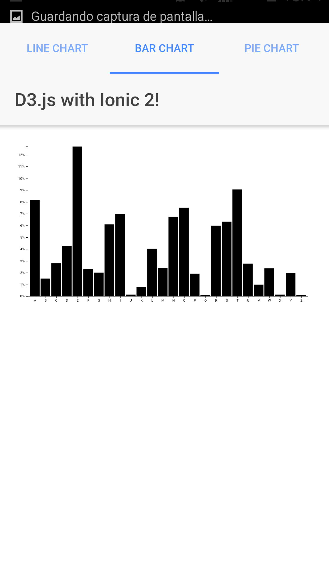
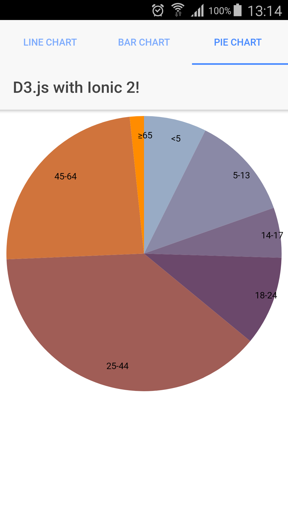

# D3.js with Ionic 3.5 Examples

This project shows how to integrate D3.js with Ionic 3.5.

We'll implement a few D3.js examples described in [bl.ocks.org](https://bl.ocks.org/) in Angular2.

##  Examples Summary

 * Line Chart
 * Bar Chart
 * Pie Chart

## Configuration

Before you go through this example, you should have at least a basic understanding of Ionic 2 concepts. You must also already have Ionic 2, Node.js and npm installed on your machine.

1. Install D3.js

```bash
	npm install d3 --save
	npm install @types/d3 --save-dev --save-exact
```
	
2. Run Ionic App

	* Test in localhost: 
	
	```bash
		ionic serve
	```

	* Test in Android/iOS mobile: 
	
		```bash
    		ionic cordova add platform android 
    		ionic cordova add platform ios
    		ionic cordova run android
    		ionic cordova run ios
    	```

	
	
     

## License
MIT License.

Original work Copyright (c) 2017 Adrián Brito  


